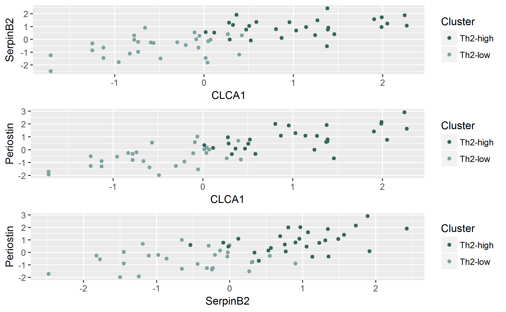

# Th2 Clusters using k-means
Allison Tai  
2017-03-15  
  
For defining the Th2-low and high subgroups, based on the expressions of periostin, CLCA1, and serpinB2, we originally intended to use hierarchical clustering, setting a boundary threshold to merge multiple clusters, if needed.  We quickly realized along the way that predefining the number of clusters defeats the purpose of hierarchical clustering, and so we chose to use the unsupervised parametric clustering method, k-means, with k = 2.  This was done through base R.  A link to the script (an .rmd file) for executing this is [here](https://github.com/STAT540-UBC/team_Undecided/blob/master/Allison_Scripts/Cluster.Rmd):  
  
This method gave us two fairly defined clusters, mostly due to very clear differences in expression of CLCA1 between the two clusters (see Figure 1).  The other two genes (periostin and serpin-B2) were less clear-cut, but even then, all samples clustered into the red cluster have higher-than-mean expression levels.  One thing that is immediately apparent is the large discrepancy between the number of samples we have in each cluster (6 in the "high - red" cluster, and 51 in the "low - blue" cluster).  To increase confidence in any results we find using this, then, we may perform resampling such as bootstrapping, as defense against false positives.  Another thing we could do, to make the boundaries of our two subgroups clearer (and again increase confidence), is to remove samples in the blue cluster that have higher expression levels of periostin, as that appears to be the gene in which definition between the two clusters are the most unclear (as well as having one clear outlier that has very high expression in periostin but very low in the other two genes).  These defined clusters can be used separately generate networks, which we can perform differential analysis on.  

**Figure 1: k-means clustering results of asthmatics based on normalized expression counts of CLCA1, serpin-B2, and periostin**
<!-- -->
